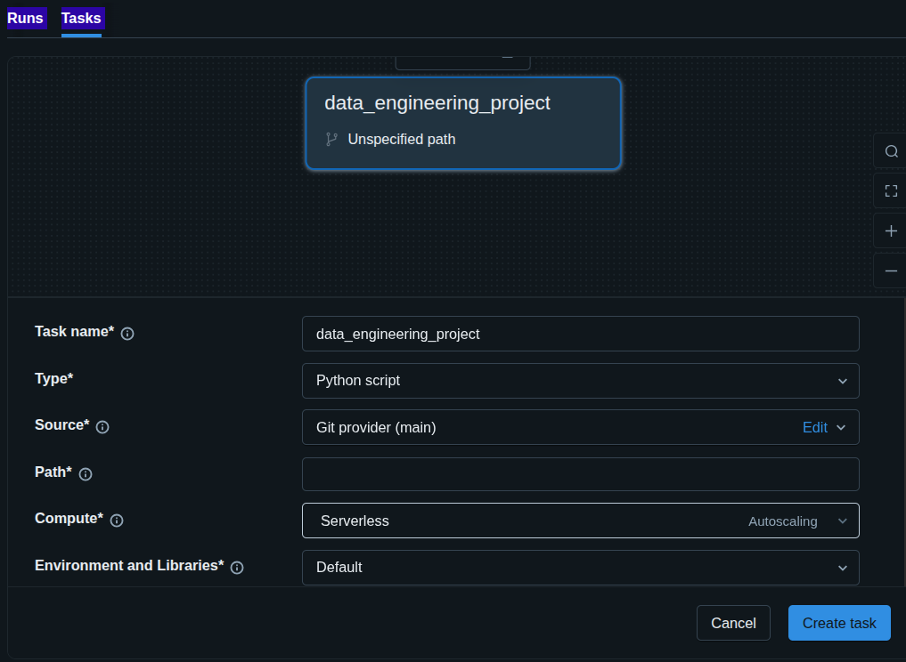
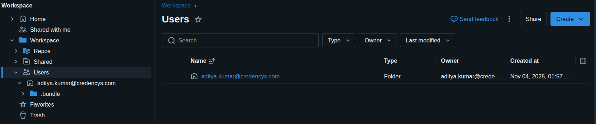
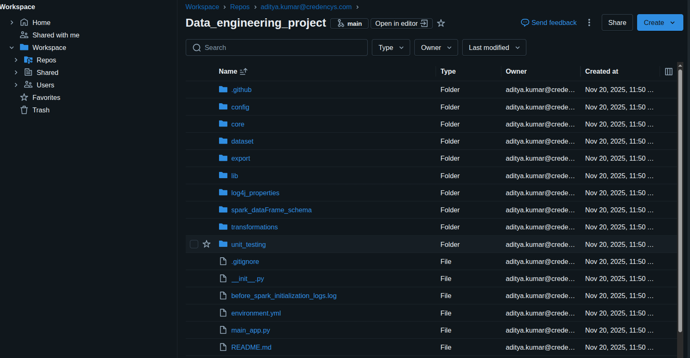

# This is a mini project that I have done 
## Project's env setup
If you want to run this project in your local machine and you want to have the same set of libraries that I have for this project then I have exported my current conda env using this command 
```bash 
    conda env export > environment.yml
```
This code will generate an environment.yml file like this 
```bash
name: pyspark
channels:
  - defaults
dependencies:
  - _libgcc_mutex=0.1=main
  - _openmp_mutex=5.1=1_gnu
  - bzip2=1.0.8=h5eee18b_6
  - ca-certificates=2025.9.9=h06a4308_0
  - expat=2.7.1=h6a678d5_0
  - ld_impl_linux-64=2.44=h153f514_2
  - libffi=3.4.4=h6a678d5_1
  - libgcc-ng=11.2.0=h1234567_1
  - libgomp=11.2.0=h1234567_1
  - libmpdec=4.0.0=h5eee18b_0
  - libstdcxx-ng=11.2.0=h1234567_1
  - libuuid=1.41.5=h5eee18b_0
  - libxcb=1.17.0=h9b100fa_0
  - libzlib=1.3.1=hb25bd0a_0
  - ncurses=6.5=h7934f7d_0
  - openssl=3.0.18=hd6dcaed_0
  - pip=25.2=pyhc872135_0
  - pthread-stubs=0.3=h0ce48e5_1
  - python=3.13.7=h7e8bc2b_100_cp313
  - python_abi=3.13=1_cp313
  - readline=8.3=hc2a1206_0
  - setuptools=80.9.0=py313h06a4308_0
  - sqlite=3.50.2=hb25bd0a_1
  - tk=8.6.15=h54e0aa7_0
  - wheel=0.45.1=py313h06a4308_0
  - xorg-libx11=1.8.12=h9b100fa_1
  - xorg-libxau=1.0.12=h9b100fa_0
  - xorg-libxdmcp=1.1.5=h9b100fa_0
  - xorg-xorgproto=2024.1=h5eee18b_1
  - xz=5.6.4=h5eee18b_1
  - zlib=1.3.1=hb25bd0a_0
  - pip:
      - alembic==1.16.5
      - annotated-types==0.6.0
      - anyio==4.11.0
      - archspec==0.2.3
      - argon2-cffi==25.1.0
      - argon2-cffi-bindings==25.1.0
      - arrow==1.3.0
      - asttokens==3.0.0
      - async-lru==2.0.5
      - attrs==25.3.0
      - authlib==1.6.5
      - azure-common==1.1.28
      - azure-core==1.35.1
      - azure-identity==1.24.0
      - azure-mgmt-core==1.6.0
      - azure-mgmt-rdbms==10.1.0
      - azure-mgmt-resource==24.0.0
      - azure-mgmt-subscription==3.1.1
      - babel==2.17.0
      - bcrypt==4.3.0
      - beautifulsoup4==4.14.2
      - bidict==0.23.1
      - bleach==6.2.0
      - blinker==1.9.0
      - boltons==25.0.0
      - boto3==1.40.45
      - botocore==1.40.45
      - brotli==1.1.0
      - brotlicffi==1.0.9.2
      - cachetools==6.2.0
      - certifi==2025.7.14
      - cffi==1.17.1
      - charset-normalizer==3.3.2
      - chispa==0.11.1
      - click==8.3.0
      - comm==0.2.3
      - contourpy==1.3.3
      - cryptography==45.0.3
      - cycler==0.12.1
      - debugpy==1.8.17
      - decorator==5.2.1
      - defusedxml==0.7.1
      - distro==1.9.0
      - dnspython==2.8.0
      - email-validator==2.3.0
      - executing==2.2.1
      - faker==37.8.0
      - fastjsonschema==2.21.2
      - flask==3.1.2
      - flask-babel==4.0.0
      - flask-compress==1.18
      - flask-login==0.6.3
      - flask-mail==0.10.0
      - flask-migrate==4.1.0
      - flask-paranoid==0.3.0
      - flask-principal==0.4.0
      - flask-security-too==5.6.2
      - flask-socketio==5.5.1
      - flask-sqlalchemy==3.1.1
      - flask-wtf==1.2.2
      - fonttools==4.60.1
      - fqdn==1.5.1
      - frozendict==2.4.2
      - google-api-core==2.25.2
      - google-api-python-client==2.184.0
      - google-auth==2.41.1
      - google-auth-httplib2==0.2.0
      - google-auth-oauthlib==1.2.2
      - googleapis-common-protos==1.70.0
      - greenlet==3.2.4
      - h11==0.16.0
      - httpcore==1.0.9
      - httplib2==0.31.0
      - httpx==0.28.1
      - idna==3.7
      - importlib-resources==6.5.2
      - iniconfig==2.3.0
      - ipykernel==6.30.1
      - ipython==9.6.0
      - ipython-pygments-lexers==1.1.1
      - ipywidgets==8.1.7
      - isodate==0.7.2
      - isoduration==20.11.0
      - itsdangerous==2.2.0
      - jaraco-classes==3.4.0
      - jaraco-context==6.0.1
      - jaraco-functools==4.3.0
      - jedi==0.19.2
      - jeepney==0.9.0
      - jinja2==3.1.6
      - jmespath==1.0.1
      - json5==0.12.1
      - jsonformatter==0.3.4
      - jsonpatch==1.33
      - jsonpointer==2.1
      - jsonschema==4.25.1
      - jsonschema-specifications==2025.9.1
      - jupyter==1.1.1
      - jupyter-client==8.6.3
      - jupyter-console==6.6.3
      - jupyter-core==5.8.1
      - jupyter-events==0.12.0
      - jupyter-lsp==2.3.0
      - jupyter-server==2.17.0
      - jupyter-server-terminals==0.5.3
      - jupyterlab==4.4.9
      - jupyterlab-pygments==0.3.0
      - jupyterlab-server==2.27.3
      - jupyterlab-widgets==3.0.15
      - keyring==25.6.0
      - kiwisolver==1.4.9
      - lark==1.3.0
      - ldap3==2.9.1
      - libgravatar==1.0.4
      - libpass==1.9.2
      - mako==1.3.10
      - markdown-it-py==2.2.0
      - markupsafe==3.0.3
      - matplotlib==3.10.6
      - matplotlib-inline==0.1.7
      - mdurl==0.1.0
      - mistune==3.1.4
      - more-itertools==10.8.0
      - msal==1.34.0
      - msal-extensions==1.3.1
      - msrest==0.7.1
      - nbclient==0.10.2
      - nbconvert==7.16.6
      - nbformat==5.10.4
      - nest-asyncio==1.6.0
      - notebook==7.4.7
      - notebook-shim==0.2.4
      - numpy==2.3.3
      - oauthlib==3.3.1
      - packaging==24.2
      - pandas==2.3.3
      - pandocfilters==1.5.1
      - paramiko==3.5.1
      - parso==0.8.5
      - passlib==1.7.4
      - pexpect==4.9.0
      - pillow==11.3.0
      - platformdirs==4.3.7
      - pluggy==1.5.0
      - prettytable==3.16.0
      - prometheus-client==0.23.1
      - prompt-toolkit==3.0.52
      - proto-plus==1.26.1
      - protobuf==6.32.1
      - psutil==7.0.0
      - psycopg==3.2.9
      - psycopg-binary==3.2.9
      - psycopg2-binary==2.9.10
      - ptyprocess==0.7.0
      - pure-eval==0.2.3
      - py4j==0.10.9.9
      - pyarrow==21.0.0
      - pyasn1==0.6.1
      - pyasn1-modules==0.4.2
      - pycosat==0.6.6
      - pycparser==2.21
      - pydantic==2.11.7
      - pydantic-core==2.33.2
      - pygments==2.19.1
      - pyjwt==2.10.1
      - pynacl==1.6.0
      - pyotp==2.9.0
      - pyparsing==3.2.5
      - pysocks==1.7.1
      - pyspark==4.0.1
      - pytest==8.4.2
      - python-dateutil==2.9.0.post0
      - python-decouple==3.8
      - python-engineio==4.12.3
      - python-json-logger==3.3.0
      - python-socketio==5.14.1
      - pytz==2025.2
      - pyyaml==6.0.3
      - pyzmq==27.1.0
      - pyzstd==0.17.0
      - qrcode==8.2
      - referencing==0.36.2
      - requests==2.32.4
      - requests-oauthlib==2.0.0
      - rfc3339-validator==0.1.4
      - rfc3986-validator==0.1.1
      - rfc3987-syntax==1.1.0
      - rich==13.9.4
      - rpds-py==0.27.1
      - rsa==4.9.1
      - ruamel-yaml==0.18.10
      - ruamel-yaml-clib==0.2.12
      - s3transfer==0.14.0
      - secretstorage==3.4.0
      - send2trash==1.8.3
      - shellingham==1.5.4
      - simple-websocket==1.1.0
      - six==1.17.0
      - sniffio==1.3.1
      - soupsieve==2.8
      - sqlalchemy==2.0.43
      - sqlparse==0.5.3
      - sshtunnel==0.4.0
      - stack-data==0.6.3
      - terminado==0.18.1
      - tinycss2==1.4.0
      - tornado==6.5.2
      - tqdm==4.67.1
      - traitlets==5.14.3
      - truststore==0.10.0
      - typer==0.16.1
      - types-python-dateutil==2.9.0.20250822
      - typing-extensions==4.12.2
      - typing-inspection==0.4.0
      - tzdata==2025.2
      - ua-parser==1.0.1
      - ua-parser-builtins==0.18.0.post1
      - uri-template==1.3.0
      - uritemplate==4.2.0
      - urllib3==2.5.0
      - user-agents==2.2.0
      - wcwidth==0.2.14
      - webcolors==24.11.1
      - webencodings==0.5.1
      - websocket-client==1.8.0
      - werkzeug==3.1.3
      - whitenoise==6.11.0
      - widgetsnbextension==4.0.14
      - wsproto==1.2.0
      - wtforms==3.2.1
      - zstandard==0.23.0
prefix: /home/aditya/miniconda3/envs/pyspark
```
You can use this command to create a new env using this environment.yml file
```bash
conda env create -f environment.yml
```
#### NOTICE : 
Remember this is only for local env in databricks conda envs are not supported.
In order to tell databricks to use certain packages or dependencies you need to use requirements.txt file and that too you don't have to mention the pyspark version because that already comes with the databricks workspace.
```bash
pyspark==4.0.1
pandas>=2.0
pyarrow>=12.0
chispa==0.11.1
pytest==8.4.2
python-decouple>=3.8
```
## Project's automated testing setup
In order to run the automated testing use this command ```python3 -m unit_testing.unit_test```

**NOTE:** One pro tip you should avoid trying to use log4j object to generate logs becuase it won't work the log4j object is attached to the sparkSession not the python session hence it won't be available for logging use python's inbuilt logging library instead.

## Run the project
You can run this project using this command 
```bash
python3 main_app.py
```

## How to setup Databricks CLI
### If you want to install databricks linux package then use this command to do so
```bash
    curl -fsSL https://raw.githubusercontent.com/databricks/setup-cli/v0.278.0/install.sh | sudo sh
```
verify if the databricks is installed or not 
```bash
    databricks -v
```
For more info you can visit this page where databricks actually shows how to install their cli command line tool on the system
https://docs.databricks.com/aws/en/dev-tools/cli/install#curl-update

### If you want to install databricks cli python varient
#### Step 1 : 
Install databricks cli tool
```bash
    pip install databricks-cli
```
#### Step 2 : 
Verify the databricks CLI tool installation
```bash
    databricks --version
    Version 0.18.0
```
#### NOTE : The steps below works only for this databrcisk version 0.18.0 or below

#### Step 3 : 
Know which CLI version you are using 
```bash
    databricks -v
```
#### Step 4 :
Configure Databricks CLI (Use PAT token)
```bash
    databricks configure --host https://<your-databricks-workspace-url>
```
**sample <your-databricks-workspace-url>**
```bash
    dbc-e59b7df7-56be.cloud.databricks.com
```
Then it will prompt you to insert 
```bash
    Databricks Host: https://sdome_string.cloud.databricks.com
    Token: some_string_here
```
#### Step 5 : 
Verify your databricks connection
```bash
    databricks workspace list
```

### Preparing databricks for Ci/Cd pipeline and github actions
#### Creating jobs on databricks
- 
- As you can see in the picture there exists a Path field
- In this Path field you need to enter path like this ```/Repos/<your-user-or-team>/<your-repo-name>/<path-to-your-python-script>.py```
    - ```<your-repo-name>``` : In here this means that you need to replace this with your github's repository name.
    - ```<your-user-or-team>``` : In here this means that you need to replace this with the username of the workspace that you created 
        - Here it the username workspace you can get as shown below in the picture below
        
- Then click create 
#### attaching github repo with your databricks 
- Go to workspace > Repos > then click on the link where it says create a Repo
- 

#### Automatic job update
databricks_job.json
```json
{
  "name": "data_engineering_project",
  "tasks": [
    {
      "task_key": "run_main",
      "python_script_task": {
        "python_file": "/Repos/<username>/<repo>/main_app.py"
      },
      "environment": {
        "environment_name": "pyspark_env",
        "dependencies": [
          "/Repos/<username>/<repo>/requirements.txt"
        ]
      },
      "job_cluster_key": "spark_cluster"
    }
  ],
  "job_clusters": [
    {
      "job_cluster_key": "spark_cluster",
      "new_cluster": {
        "spark_version": "14.3.x-scala2.12",
        "node_type_id": "i3.xlarge",
        "num_workers": 1
      }
    }
  ]
}
```

### ROAD BLOCK HIT
🔴 Databricks Free Edition does NOT support Git-linked Repos

On Free Edition:

You can create folders named “Repos”

You can upload files

You can view code

BUT:

❌ You CANNOT create real Databricks Repos
❌ You CANNOT link GitHub
❌ You CANNOT use databricks repos CLI
❌ You CANNOT get a repo-id (because it does not exist)

This is EXACTLY why:

Your URL always shows /browse/folders/...

It never shows #repo/<id>/files

databricks repos list returns nothing

The job task UI only allows uploading files — not linking code from a repo